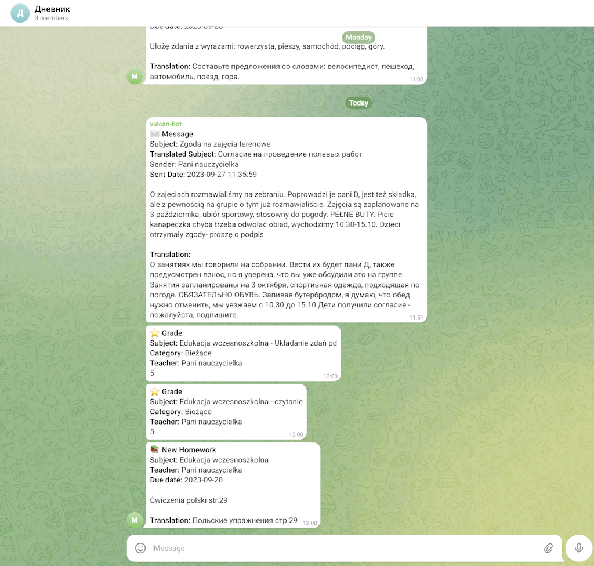
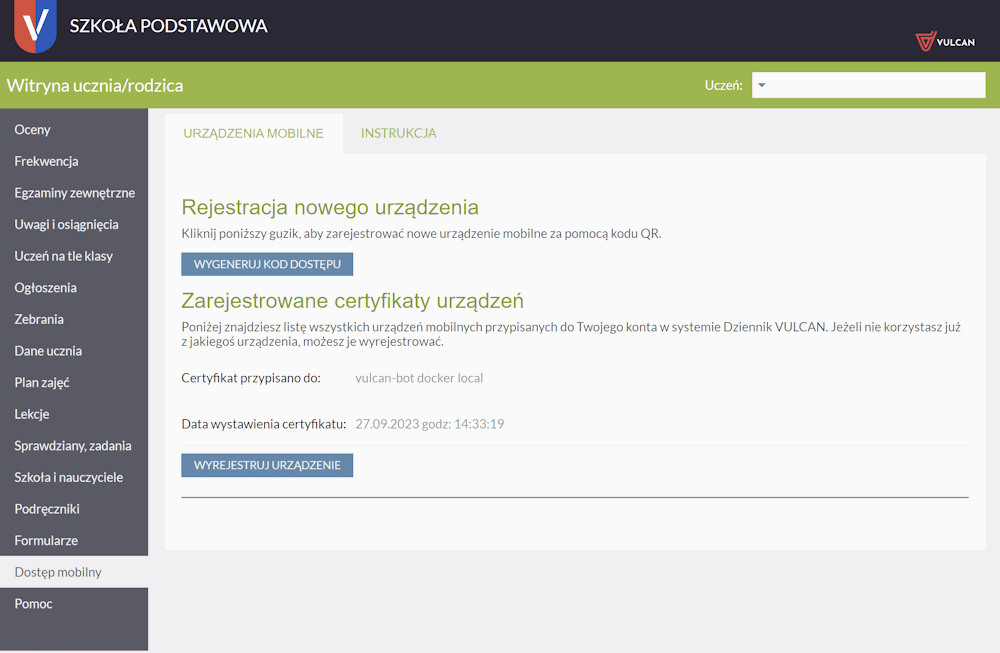
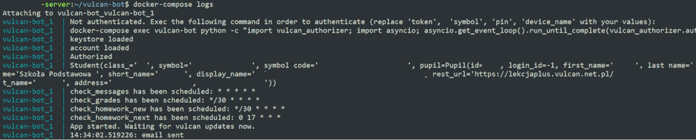

# Vulcan Bot 🤖

Vulcan Bot is a non-interactive Telegram bot designed to fetch and forward updates from the Dziennik Vulcan e-diary system. It informs you about new messages, grades and homeworks. The bot can optionally translate the fetched information from Polish to a language of your choice using the Deepl API.

## Features ✨
- **Automatic Updates**: Fetches new messages, grades, assignments on a set schedule.
- **Translation**: Optionally translates messages from Polish to the specified language using Deepl.
- **Dockerized**: Easily deployed using Docker and docker-compose.

## Limitations ⚠️
- No interactive mode; it doesn’t respond to incoming commands.
- Can only forward information to one specified Telegram chat.
- Supports only one user account on Dziennik Vulcan.

## Installation & Deployment 🚀

### Prerequisites
- Docker and docker-compose installed on your system.

### Steps
1. **Clone the repository**: 
    ```shell
    git clone https://github.com/ilugakov/vulcan-bot.git
    cd vulcan-bot
    ```
2. **Configure the .env file**: The `.env` file is included in the root directory with empty or default values for some parameters (see below for details).
3. **Build and Start the Docker Container**: 
    ```shell
    docker-compose up --build -d
    ```
4. **Authenticate Vulcan Bot with Dziennik Vulcan**:

    The Token, Symbol and PIN need to be obtained from the Vulcan e-register student/parent panel (in the “Mobile access/Dostęp mobilny” tab)

    Replace 'token', 'symbol' and 'pin' arguments with your values and run the following command:

    ```shell
    docker-compose exec vulcan-bot python -c "import vulcan_authorizer; import asyncio; asyncio.get_event_loop().run_until_complete(vulcan_authorizer.authenticate('token', 'symbol', 'pin', 'device_name'))" && docker-compose restart vulcan-bot
    ```

## Configuration 🔧

Update the `.env` file with the following parameters:

```env
MESSAGES_SCHEDULE=* * * * *
GRADES_SCHEDULE=*/30 * * * *
NEW_HOMEWORK_SCHEDULE=*/30 * * * *
NEXT_HOMEWORK_SCHEDULE=0 17 * * *
DEEPL_LANG=EN
DEEPL_KEY=
BOT_TOKEN=
ALLOWED_CHAT_ID=
```

### Explanation:
- `*_SCHEDULE` parameters use the cron syntax to set the schedule for checking updates. If left empty or invalid, the schedule won't run. [Learn about cron syntax here](https://crontab.guru/examples.html).
  - `MESSAGES_SCHEDULE=* * * * *`: Checks for new messages every minute.
  - `GRADES_SCHEDULE=*/30 * * * *`: Checks for new grades every 30 minutes.
  - `NEW_HOMEWORK_SCHEDULE=*/30 * * * *`: Checks for new homework every 30 minutes.
  - `NEXT_HOMEWORK_SCHEDULE=0 17 * * *`: Checks for the homework with the closest deadline at 5:00 PM every day.
- `DEEPL_LANG` and `DEEPL_KEY` are optional and required only for translation. Set the desired target language and your Deepl API key. To obtain a Deepl API key, [follow this guide](https://www.deepl.com/ru/pro-api?cta=header-pro-api).
- `BOT_TOKEN` and `ALLOWED_CHAT_ID` are mandatory:
  - For `BOT_TOKEN`, you need to create a new bot on Telegram. Follow [this guide](https://core.telegram.org/bots#botfather) to learn how.
  - To find the `ALLOWED_CHAT_ID`, create a new group on Telegram, add [getidsbot](https://t.me/getidsbot) to the group, and it will display the group's ID. After acquiring the ID, remove getidsbot and add your Vulcan Bot to the group. Set the group ID as the value for `ALLOWED_CHAT_ID`.

## Screenshots 📸
<details>
<summary>Example of the bot output</summary>


</details>


<details>
<summary>App registered in Vulcan system</summary>


</details>


<details>
<summary>Example of the correct log output</summary>


</details>

## License 📄
This project is licensed under the MIT License - see the [LICENSE](LICENSE) file for details

## Support & Contribution 🤝
Feel free to contribute to the development of Vulcan Bot. If you have any issues or need support, please open an issue on this repository.